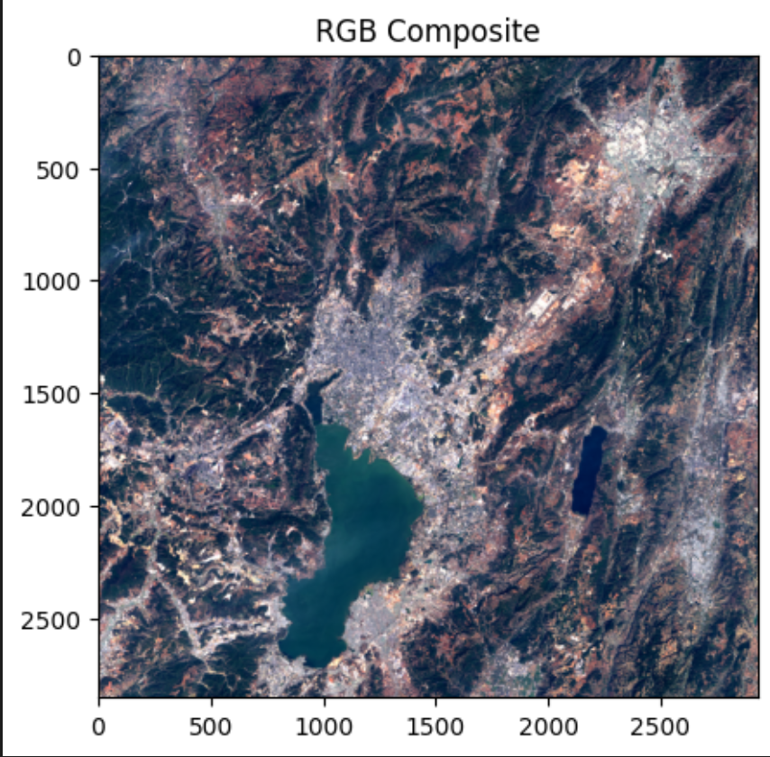
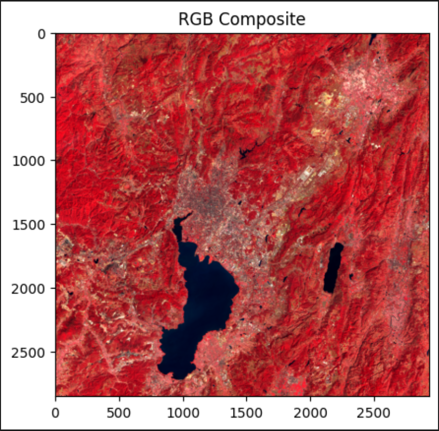
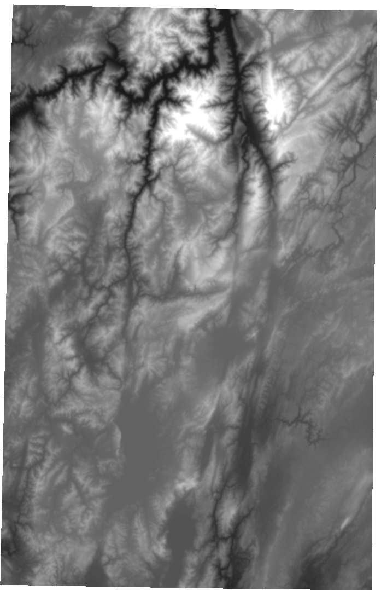
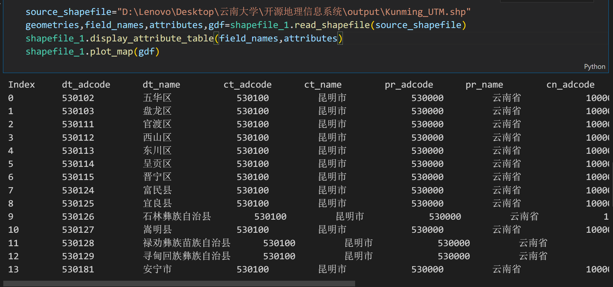
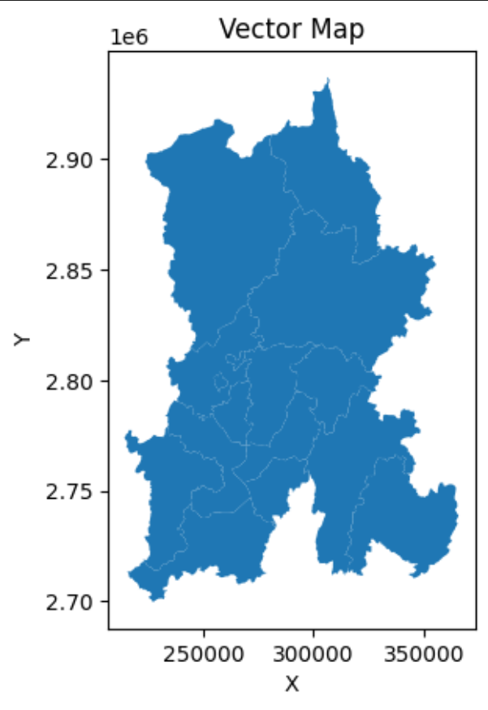
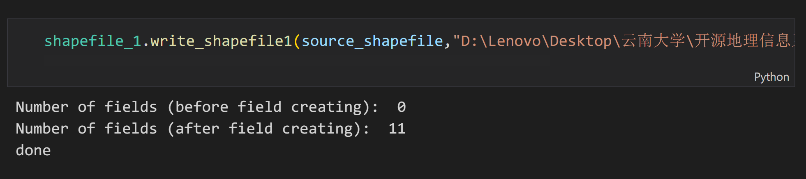
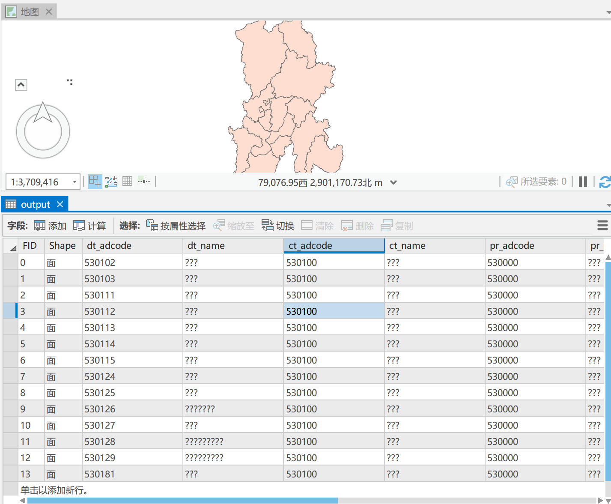

# 调用自定义函数读写数据
## 准备工作与思路
在编写程序之初，我希望使用模块化的方式组织编写的函数，便于调用。一般来说，python中“模块化编程”的层次自底向上的顺序为：   
1. 函数、变量、类  
2. 模块(.py文件)，py文件中可以包含多个函数、变量、类       
3. 包(package)，包中可以包含多个模块，包是一个文件夹，该文件夹中必须包含__init__.py文件   
在实验过程中，准备编写两个模块，分别用于处理对矢量数据的操作和对栅格数据的操作，由于本次实验需要编写的代码量较少，我没有使用包的层级来组织代码，而是将两个模块与主函数放在一个文件夹中，在主函数里直接调用模块。

## 对栅格数据的操作   
### 读取和显示单波段栅格数据   
1. 创建一个python文件，命名为“raster_1.py”，在其中实现打开单波段栅格数据的函数read_raster(raster_path,band)。这个函数用于接收一个栅格数据的路径和一个波段号，读取该栅格数据，并返回该栅格数据地理转换参数、投影数据、波段数和指定波段数据。该函数如下：
~~~
def read_raster(raster_path,band):
    dataset = gdal.Open(raster_path)

    if dataset is None:
        raise Exception(f"Unable to open raster file: {raster_path}")

    # 获取地理转换参数
    geo_trans = dataset.GetGeoTransform()

    width = dataset.RasterXSize
    height = dataset.RasterYSize
    num_bands = dataset.RasterCount

    #获取投影
    proj = dataset.GetProjection()

    #获取影像某一个波段
    band_data=dataset.GetRasterBand(band)

    # 以numpy数组方式读入栅格影像
    band_array=band_data.ReadAsArray()

    return geo_trans,proj, num_bands, band_array
~~~
2. 在主函数中加载这个python文件，调用read_raster函数。并利用matplotlib.pyplot模块显示栅格数据。主要代码如下：
~~~
raster_path="D:\Lenovo\Desktop\云南大学\开源地理信息系统\output\昆明市_高程_Level_14.tif"
geo_trans,proj,band_count,band_array= raster_1.read_raster(raster_path,1)
print("geo_trans:",geo_trans,"\nproj:",proj,"\nband_count:",band_count)
print("shape of array:",band_array.shape)
plt.figure()
plt.imshow(band_array, vmax=4000, vmin=0, cmap='gray')
~~~
运行结果为：
   
   
### 读取并设置波段组合以显示多波段数据
1. 在raster_1.py中新建一个函数read_multiband(raster_path, band_indices=(1, 2, 3),stretch=True)，该函数用于从指定路径读取一个多波段影像，并指定显示哪些波段，以及是否对波段进行拉伸。相较于单波段影像的操作，这个函数中主要增加了np.stack函数以完成波段合成，然后使用np.percentile函数对波段进行拉伸。并且由于plt.imshow函数在显示彩色合成影像时要求像元值为[0,255]或[0,1]，故使用matplotlib.colors模块的Normalize函数将进行彩色合成的波段归一化到0~1。主要代码如下：   
~~~
def read_multiband(raster_path, band_indices=(1, 2, 3),stretch=True):
    dataset = gdal.Open(raster_path)

    if dataset is None:
        raise Exception(f"Unable to open raster file: {raster_path}")

    # 获取地理转换参数
    geo_trans = dataset.GetGeoTransform()

    width = dataset.RasterXSize
    height = dataset.RasterYSize
    num_bands = dataset.RasterCount

    # 获取投影
    proj = dataset.GetProjection()

    # 以numpy数组方式读入栅格影像
    raster_data = dataset.ReadAsArray()

    # 选择指定的波段
    selected_bands = [raster_data[band_idx - 1] for band_idx in band_indices]

    # 彩色合成为RGB影像
    rgb_image = np.stack(selected_bands, axis=-1)

        # 对图像进行拉伸显示
    if stretch:
        min_val, max_val = np.percentile(rgb_image,2), np.percentile(rgb_image,98)
        norm = Normalize(vmin=min_val, vmax=max_val)
        stretched_rgb = norm(rgb_image)

        # 显示拉伸后的影像
        plt.imshow(stretched_rgb)
    else:
        # 显示原始影像
        plt.imshow(rgb_image)
        
    plt.title("RGB Composite")
    plt.show()

    return geo_trans, proj, num_bands, rgb_image
~~~   
2. 对read_multiband函数进行调用，这里读入的影像是一幅Landsat 8影像，选择4，3，2波段进行彩色合成，预计将得到一幅真彩色图像。
~~~
multiband_raster_path="D:\Lenovo\Desktop\云南大学\开源地理信息系统\Chapter5_data\data2.tif"
geo_trans, proj, num_bands, rgb_image=raster_1.read_multiband(multiband_raster_path,(4,3,2),True)
~~~

将合成波段改为5，4，3，进行标准假彩色合成,这种图像常用于提取植被或水体：

### 写出栅格数据
1. 添加一个新函数write_raster(output_path,band_array,geo_trans,proj)，这个函数接收输出路径，包含像元信息的数组、地理变换和投影信息，将数组写入栅格文件。
~~~
def write_raster(output_path,band_array,geo_trans,proj):
    driver = gdal.GetDriverByName("GTiff")  ## 创建.tif文件驱动
    outdset = driver.Create(output_path, xsize=band_array.shape[1], \
                                    ysize=band_array.shape[0], bands=1, eType=gdal.GDT_Int16)  ### 创建空的.tif数据
    outdset.SetGeoTransform(geo_trans)    ### 设置地理转换参数
    outdset.SetProjection(proj)           ### 设置投影
    outband = outdset.GetRasterBand(1)    ### 获取波段1
    outband.WriteArray(band_array)        ### 将np.array()数组写入波段1
    outband.SetNoDataValue(np.nan)        ### 设置特定值为无数据，具有压缩功能
    outdset = None    ## 关闭.tif文件驱动
    print("done")
~~~
2. 调用write_raster函数，影像写出到文件中。使用QGIS打开能够正常打开影像。

## 对矢量数据的操作   
### 读取矢量数据
1. 新建一个.py文件，命名为shapefile_1.py,在其中添加一个新函数read_shapefile(shapefile_path)，用于从文件中打开shapefile文件。
~~~
def read_shapefile(shapefile_path):
    driver = ogr.GetDriverByName('ESRI Shapefile')
    dataset = driver.Open(shapefile_path)
    layer = dataset.GetLayer()
    gdf = gpd.read_file(shapefile_path)
    
    # 获取字段名
    field_names = [field.GetName() for field in layer.schema]

    # 获取要素与属性
    geometries = []
    attributes = []

    for feature in layer:
        geometry = feature.GetGeometryRef()
        attributes.append([feature.GetField(field) for field in field_names])
        geometries.append(geometry)

    dataset = None 
    return geometries, field_names, attributes,gdf
~~~

2. 输出shp文件的几何要素与属性表
在shapefile_1.py文件中添加一个新函数plot_map用于绘制地图，以及display_attribute_table用于遍历属性表并输出字段名称和字段值。   
~~~
def plot_map(gdf):
    # 绘制地图
    gdf.plot()

    # 显示地图
    plt.xlabel('X')
    plt.ylabel('Y')
    plt.title('Vector Map')
    plt.show()
~~~
    
~~~
def display_attribute_table(field_names, attributes):
    print("{:<10}".format("Index"), end="")
    ##输出字段名
    for name in field_names:
        print("{:<15}".format(name), end="")
    print()  
    ##输出字段值
    for i, row in enumerate(attributes):
        print("{:<10}".format(i), end="")
        for value in row:
            print("{:<15}".format(value), end="")
        print() 
~~~   
调用结果如下：

   
### 写出矢量数据  
添加新函数write_shapefile1，用于写出shp文件，在该函数中，首先创建一个文件驱动，然后创建空图层，并将属性表和几何要素写入空图层中，以创建要素，最后关闭文件驱动。
~~~
def write_shapefile1(source_path,output_path):
    ds = ogr.Open(source_path, 0)           # 0是只读，1是可写
    layer = ds.GetLayer()    # 获取矢量文件Layer
    ### 
    driver = ogr.GetDriverByName('ESRI Shapefile')
    ds_out = driver.CreateDataSource(output_path)
    layer_out = ds_out.CreateLayer('vector_new_2', geom_type=ogr.wkbPolygon, srs=layer.GetSpatialRef())
    fea_defn = layer_out.GetLayerDefn()    ## 获得空要素定义(或空图层定义)

    ### 创建字段
    layer_defn = layer_out.GetLayerDefn()
    print('Number of fields (before field creating): ', layer_defn.GetFieldCount())  ### 字段创建前字段数
    fea = layer.GetFeature(0)
    for i in range(fea.GetFieldCount()):
        field_defn = fea.GetFieldDefnRef(i)
        layer_out.CreateField(field_defn)
    layer_defn = layer_out.GetLayerDefn()
    print('Number of fields (after field creating): ', layer_defn.GetFieldCount())

    for fea in layer:
        fea_out = ogr.Feature(fea_defn)
        fea_out.SetGeometry(fea.geometry())
        for i in range(fea.GetFieldCount()):
            field_value = fea.GetField(i)
            fea_out.SetField(i, field_value)
        layer_out.CreateFeature(fea_out)
    ds_out = None        
    print("done")
~~~
写出shp文件后，能够正常打开文件与属性表。

  
## 实验中遇到的问题与解决方法
1. 自定义模块的引入：   
自定义的py模块无法像numpy或os那样直接通过import引入，尝试引入时会报错：“未定义”。因为该模块不在python默认的标准库路径下，需要使用sys.path.append({存放自定义模块的绝对路径})将模块路径添加到sys.path中；或将py文件复制到lib\site-packages文件夹下。   