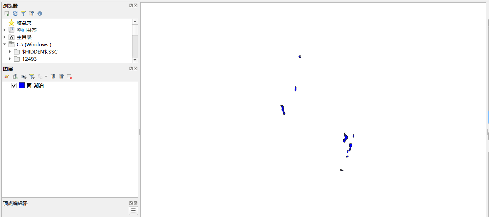
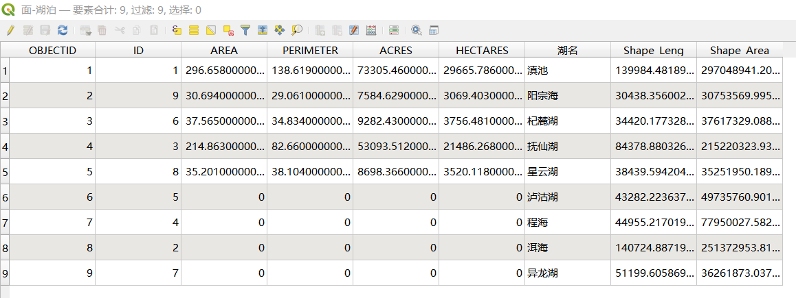
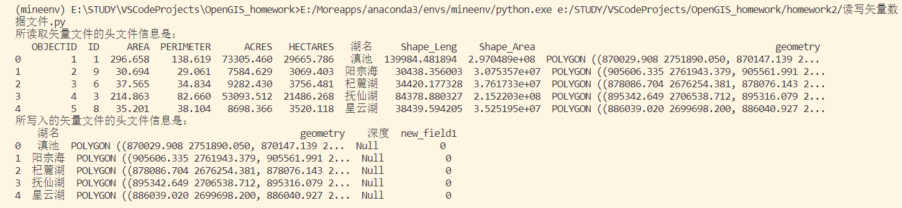
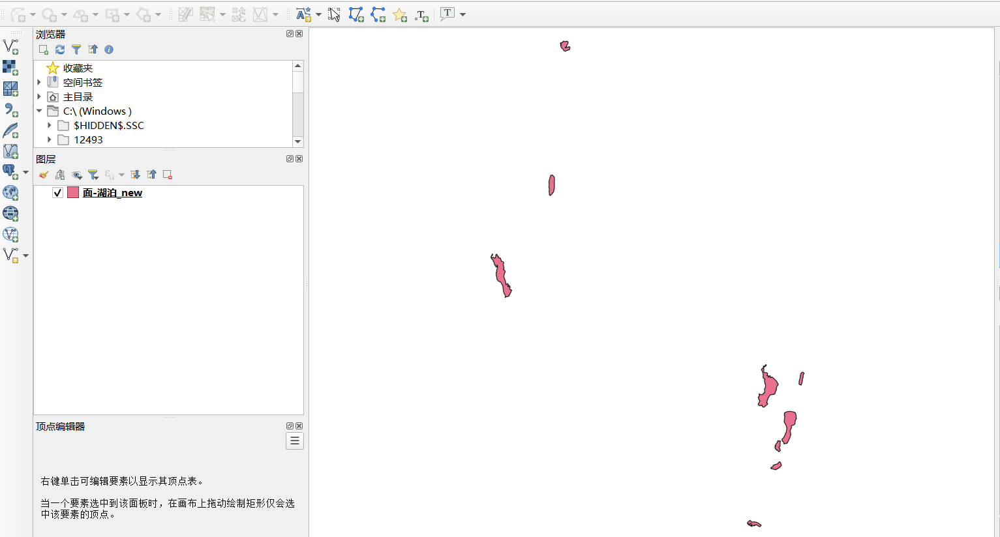
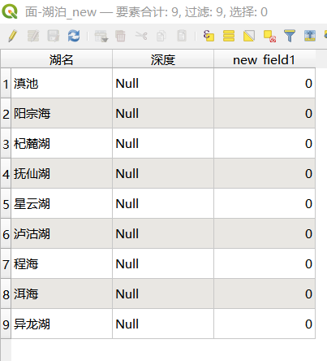
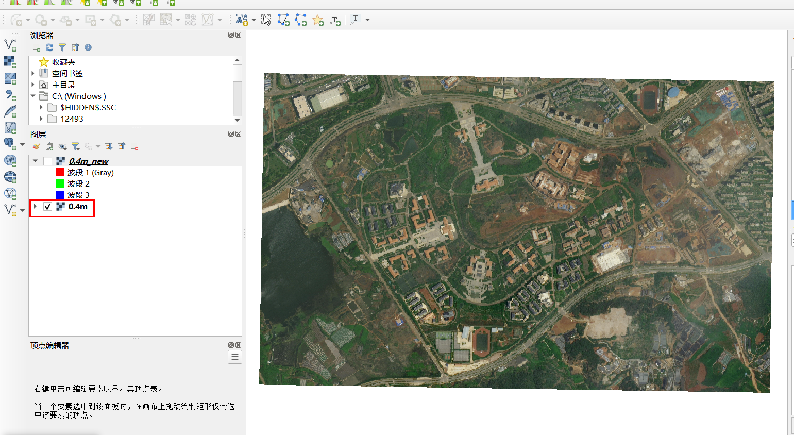
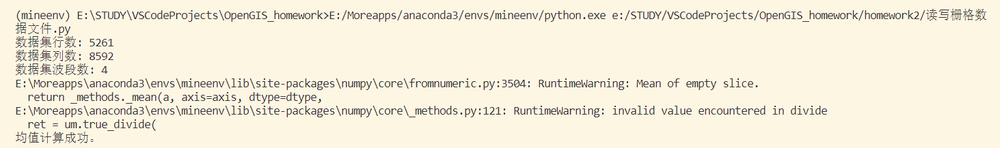
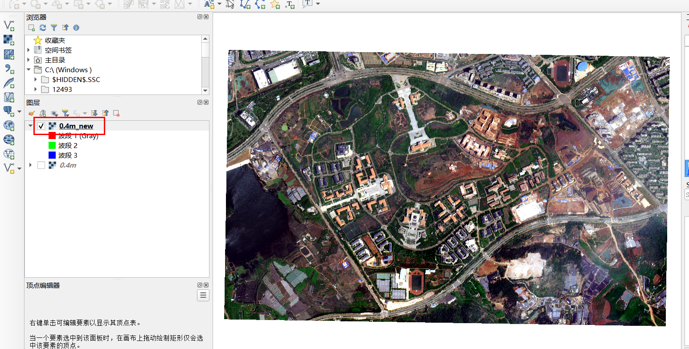

# 开源GIS第二次作业
## 完成矢量数据，栅格数据便捷读写函数及使用说明。 
### 学号：20211170034  姓名：王盈怡  专业：地理信息科学
---
### 具体过程
#### 1. 实验数据与环境
   * 代码运行的实验数据：
     * 所要读取的矢量数据为昆明市湖泊矢量数据
     * 所要读取的栅格数据为云南大学呈贡校区遥感影像数据（0.4m分辨率）
   * 代码运行环境：Python2019（插件）+VSCode平台


#### 2. 实验方法与实验步骤
   * ***实验方法（算法思路）***：
     * 编写读取矢量数据与栅格数据的代码后，再将其封装设计为函数并演示其用法，并在函数内部撰写说明文档。    
  
   * ***具体实验步骤***
   **1. 读写矢量数据过程**
   先在QGIS中加载需要读取的矢量数据查看：
     

   
   
   **矢量读写的具体代码思路：**
 * 导入geopandas模块，用于处理矢量数据。
 * 定义输入和输出文件的路径，分别为path_input_vector和path_out_vector。
  * 使用gpd.read_file函数从输入文件中读取矢量数据，返回一个GeoDataFrame对象，并赋值给input_vector变量。同时打印出输入文件的头文件信息。
  * 对读写后的矢量数据进行一定的处理。如使用gpd.GeoDataFrame函数从input_vector中选择指定字段、创建新字段。
  * 使用out_vector.to_file函数，将out_vector写入至输出文件。

**具体代码如下：**

```python

import geopandas as gpd
path_input_vector = r"E:\STUDY\GIS应用开发\GIS应用开发——实验\400w基础数据\云南省基础数据-shapefile\面-湖泊.shp"
input_vector = gpd.read_file(path_input_vector, encoding='gb2312')
print("所读取矢量文件的头文件信息是：")
print(input_vector.head())

# 创建 GeoDataFrame
out_vector = gpd.GeoDataFrame(input_vector[["湖名", "geometry"]])

# 添加新字段并初始化为0
out_vector["深度"] = "Null"
out_vector["new_field1"] = 0

path_out_vector = r"E:\STUDY\GIS应用开发\GIS应用开发——实验\400w基础数据\云南省基础数据-shapefile\面-湖泊9.shp"
out_vector.to_file(path_out_vector, encoding='utf-8')
print("所写入的矢量文件的头文件信息是：")
print(out_vector.head()) 
```
   **其终端运行结果如下：**  
可以看到正确地读取了矢量文件并且打印出其信息。

   **其所新写入的矢量数据文件及属性表如下**：     
    可以看到新写入的矢量文件已经筛选出了特定的字段（“湖名”）并且创建了两个新的字段（“深度”和随机的一个名字“new_field1”）。


**2. 编写读写栅格数据过程代码**
   在QGIS中加载需要读取的矢量数据进行查看： 

   **栅格读写的具体代码思路：**
   * 从一个给定的路径打开一个栅格数据文件，获得其数据集的行数、列数和波段数，以及地理变换和投影信息。
   * 将读取数据集的所有数据转为一个三维数组。
   * 对读取的栅格数据进行一些处理，如选择数据集的一部分数据，根据给定的起始和结束的行、列和波段，计算这部分数据在波段方向上的均值，得到一个二维数组。
   * 创建一个空的栅格数据文件，使用与原数据集相同的行数、列数、波段数、地理变换和投影等。
   * 将经过处理的原数据集的数据写入新的数据文件，每个波段对应一个栅格带。关闭新的数据文件和原数据文件，释放资源。


**具体代码如下**：

```python

from osgeo import gdal
import numpy as np

file_path = r'C:\Users\12493\Desktop\0.4m.tif'
output_path = r'C:\Users\12493\Desktop\0.4m_new.tif'

# 打开栅格数据文件
dataset = gdal.Open(file_path)
if dataset is None:
    raise Exception(f"Failed to open file: {file_path}")

# 打印行列数与波段数信息
print(f"数据集行数: {dataset.RasterYSize}")
print(f"数据集列数: {dataset.RasterXSize}")
print(f"数据集波段数: {dataset.RasterCount}")

# 获取基本信息
geo_transform = dataset.GetGeoTransform()
projection = dataset.GetProjection()
x_size, y_size, bands = dataset.RasterXSize, dataset.RasterYSize, dataset.RasterCount

# 读取数据
data = dataset.ReadAsArray(0, 0, x_size, y_size)
data[data < 0] = 0  # 将小于0的像素值赋值为0

# 选择部分数据并计算均值
start_row, end_row = 2000, 3000
start_col, end_col = 0, 6000
start_band, end_band = 0, 4

# 检查切片范围是否在有效范围内
if 0 <= end_row <= y_size and 0 <= end_col <= x_size and 0 <= end_band <= bands:
    # 计算均值
    selected_data = np.mean(data[start_row:end_row, start_col:end_col, start_band:end_band], axis=0)
    print("均值计算成功。")
else:
    print("切片范围超出数据集有效范围。")

# 创建新的栅格数据文件
driver = gdal.GetDriverByName("GTiff")
output_dataset = driver.Create(output_path, x_size, y_size, bands, gdal.GDT_Float32)
output_dataset.SetGeoTransform(geo_transform)
output_dataset.SetProjection(projection)

# 写入数据
for i in range(bands):
    output_band = output_dataset.GetRasterBand(i + 1)
    output_band.WriteArray(data[i])

# 设置NoData值，如果不需要可以省略
for i in range(bands):
    output_band = output_dataset.GetRasterBand(i + 1)
    output_band.SetNoDataValue(0)

# 关闭数据集
output_dataset = None
dataset = None

```

   **其最终运行结果如下：**
   可以看到其所读取的栅格数据信息。

   **其所新写入的栅格数据文件如下：（可以看到新写入的栅格文件图像对比度增高了，变得明亮而清晰）** 


   ***当完整地编写过读取矢量与栅格数据的过程后，结合上述代码来总结，设计4个函数专门针对矢量、栅格数据的读取与写入，同时展示函数的用法。***

   **3.最终，读写矢量栅格数据的函数的代码如下**
   **(注：有关函数的使用说明文档与示例均在代码块中）**

```python
from osgeo import gdal
import numpy as np
import geopandas as gpd

def read_vector(file_path):
    """
    读取矢量数据的函数

    功能描述: 
    从输入文件中读取矢量数据，并获取其属性和几何信息，返回一个GeoDataFrame对象。

    参数列表: 
    - file_path: str, 矢量数据文件路径，必须是有效的shp文件，否则会抛出异常。

    返回值: 
    - input_vector: GeoDataFrame, 矢量数据，包含属性和几何字段，可以进行后续的处理和分析。

    示例: 具体示例在代码块后面，此处不详写。
    
    注意事项: 
    - file_path 必须是一个字符串，不能是其他类型。
    - file_path 必须指向一个存在的shp文件，否则会触发 ValueError 异常。
    - input_vector 是一个 GeoDataFrame 对象，可以使用 geopandas 模块提供的方法进行操作。
    """

    # 读取矢量数据函数实现
    input_vector = gpd.read_file(file_path, encoding='gb2312')
    print("所读取的矢量文件的头文件信息是：")
    print(input_vector.head())
    return input_vector

def write_vector(output_path, out_vector):
     """
    写入矢量数据的函数

    功能描述: 
    将给定的GeoDataFrame对象写入到指定的输出路径。

    参数列表: 
    - output_path: str, 输出文件路径，必须以.shp结尾，否则会抛出异常。
    - out_vector: GeoDataFrame, 即待写入的矢量数据。

    返回值: 无

    示例: 具体示例在代码块后面，此处不详写。

    注意事项: 
    - output_path 必须是一个字符串，不能是其他类型。
    - output_path 必须以.shp结尾，否则会触发 ValueError 异常。
    - out_vector 必须是一个 GeoDataFrame 对象。
    """ 

    # 写入矢量数据函数实现
    out_vector.to_file(output_path, encoding='utf-8')
    print("所写入的矢量文件的头文件信息是：")
    print(out_vector.head())

def read_raster(file_path):
      """
    读取栅格数据的函数

    功能描述: 
    从输入文件中读取栅格数据，并获取其基本信息和数据，返回一个三维数组和地理转换参数和投影信息。

    参数列表: 
    - file_path: str, 栅格数据文件路径，必须是有效的tif文件，否则会抛出异常。

    返回值: 
    - data: numpy.ndarray, 栅格数据，一个三维数组，第一维表示波段数，第二维表示行数，第三维表示列数。
    - geo_transform: tuple, 地理转换参数，包含六个元素，分别表示左上角的经度、像元宽度、旋转角度、左上角的纬度、旋转角度和像元高度。
    - projection: str, 投影信息，表示数据的坐标系和投影方式。
    - x_size: int, 数据集的列数。
    - y_size: int, 数据集的行数。
    - bands: int, 数据集的波段数。

    示例: 具体示例在代码块后面，此处不详写。

    注意事项: 
    - file_path 必须是一个字符串，不能是其他类型。
    - file_path 必须指向一个存在的tif文件，否则会触发 RuntimeError 异常。
    - data 是一个 numpy.ndarray 对象，可以使用 numpy 模块提供的方法进行操作。
    - geo_transform 和 projection 是栅格数据的重要属性，可以用于转换坐标和投影。
    """
    # 打开栅格数据文件函数实现
    dataset = gdal.Open(file_path)
    if dataset is None:
        raise Exception(f"Failed to open file: {file_path}")

    # 打印行列数与波段数信息
    print(f"数据集行数: {dataset.RasterYSize}")
    print(f"数据集列数: {dataset.RasterXSize}")
    print(f"数据集波段数: {dataset.RasterCount}")


    # 获取基本信息
    geo_transform = dataset.GetGeoTransform()
    projection = dataset.GetProjection()
    x_size, y_size, bands = dataset.RasterXSize, dataset.RasterYSize, dataset.RasterCount
    # 读取数据
    data = dataset.ReadAsArray(0, 0, x_size, y_size)
    data[data < 0] = 0  # 将小于0的像素值赋值为0
    return data, geo_transform, projection,x_size,y_size,bands

def write_raster(output_path, out_raster, geo_transform, projection,x_size,y_size,bands):
    """
    写入栅格数据的函数

    功能描述: 
    将一个三维数组和地理转换参数和投影信息写入到指定的输出路径，可以设置NoData值。
    参数列表:
    - output_path: str, 输出文件路径，必须以.tif结尾，否则会抛出异常。
    - out_raster: numpy.ndarray, 待写入的栅格数据，一个三维数组，第一维表示波段数，第二维表示行数，第三维表示列数。
    - geo_transform: tuple, 地理转换参数，包含六个元素，分别表示左上角的经度、像元宽度、旋转角度、左上角的纬度、旋转角度和像元高度。
    - projection: str, 投影信息，表示数据的坐标系和投影方式。
    - x_size: int, 数据集的列数。
    - y_size: int, 数据集的行数。
    - bands: int, 数据集的波段数。
  
    返回值: 无

    示例:具体示例在代码块后面，此处不详写。


    注意事项:
    - output_path 必须是一个字符串，不能是其他类型。
    - output_path 必须以.tif结尾，否则会触发 ValueError 异常。
    - geo_transform 和 projection 必须与原数据集的地理转换参数和投影信息一致，否则会导致数据的位置和坐标错误。
    - NoData值可以根据需要设置，一般用于表示无效或缺失的数据，可以提高数据的可读性和分析效果。
   """

    # 栅格读写函数实现
    # 首先创建新的栅格数据文件
    driver = gdal.GetDriverByName("GTiff")
    output_dataset = driver.Create(output_path, x_size, y_size, bands, gdal.GDT_Float32)
    output_dataset.SetGeoTransform(geo_transform)
    output_dataset.SetProjection(projection)

    out_raster

   # 写入数据
    for i in range(bands):
        output_band = output_dataset.GetRasterBand(i + 1)
        output_band.WriteArray(data[i])
   # 设置NoData值，如果不需要可以省略
    for i in range(bands):
        output_band = output_dataset.GetRasterBand(i + 1)
        output_band.SetNoDataValue(0)
   # 关闭数据集
    output_dataset = None

   # 使用示例
   # 读写矢量数据的函数示例用法
   file_path_vector = r"C:\Users\12493\Desktop\矢量栅格数据读写处理\面-湖泊.shp"
   output_path_vector = r"C:\Users\12493\Desktop\矢量栅格数据读写处理\面-湖泊_new.shp"
   # 使用“读取矢量”的函数
   input_vector = read_vector(file_path_vector)
   # 对读取后的矢量进行一些处理再写入——筛选特定字段以及添加新字段并初始化
   out_vector = gpd.GeoDataFrame(input_vector[["湖名", "geometry"]])
   out_vector["深度"] = "Null"
   out_vector["new_field1"] = 0
  # 使用“写入矢量”的函数对做过所读取并且做过处理的矢量数据进行写入。
  write_vector(output_path_vector, out_vector)
  print("读写矢量文件完成！")
  # 读写栅格数据的函数示例用法
  file_path_raster = r'C:\Users\12493\Desktop\矢量栅格数据读写处理\0.4m.tif'
  output_path_raster = r'C:\Users\12493\Desktop\矢量栅格数据读写处理\0.4m_new.tif'
  # 使用“读取栅格”的函数
  data, geo_transform, projection,x_size,y_size,bands = read_raster(file_path_raster)
  # 选择部分数据并计算均值
  start_row, end_row = 2000, 3000
  start_col, end_col = 0, 6000
  start_band, end_band = 0, 4
  # 检查切片范围是否在有效范围内
  if 0 <= end_row <= y_size and 0 <= end_col <= x_size and 0 <= end_band <= bands:
        # 计算均值
        out_raster = np.mean(data[start_row:end_row, start_col:end_col, start_band:end_band], axis=0)
        print("均值计算成功。")
  else:
        print("切片范围超出数据集有效范围。")

  # 使用“写入栅格”的函数对所读取的并做过处理的栅格数据进行写入
  write_raster(output_path_raster, out_raster, geo_transform, projection, x_size, y_size, bands)
  print("读写栅格文件完成！")

```
**代码运行终端结果：** 
即成功读取了矢量文件数据与栅格文件数据，并且根据读取的文件创建了新的文件，将读取并处理后的矢量、栅格信息写入了新的文件。所新写入的矢量文件与栅格文件就是前面的矢量与栅格新数据。（不重复放截图了）。

#### 3. 实验结果
   **实验结果截图见第二部分实验步骤。**
主要完成了矢量与栅格数据读写函数的python代码编写，并对其读写函数用法做了示例。读写矢量代码示例演示了如何使用 gpd.read_file() 读取 shapefile，并使用 to_file() 将 GeoDataFrame 写入 shapefile。读写栅格代码展示了如何使用 gdal.Open() 读取栅格数据，并将处理过的栅格数据写入新的 GeoTIFF 文件。
   
#### 4. 实验总结
   
1. 使用Geopandas 用于矢量数据读写：geopandas 是一个专为处理和分析**矢量**数据的Python 库。它扩展了 pandas 的功能，提供了一个用户友好的接口，用于读取和写入矢量数据，并比直接使用 gdal 和 ogr 库相比更加简便。
2. 使用 GDAL 进行栅格数据读写：对于栅格数据的简便读写，GDAL是一个非常强大而全面的选择，但可能相对庞大。（之后可以考虑使用rasterio库，Rasterio建立在GDAL之上，提供了更简单、更Pythonic的接口，特别适用于常见的栅格数据读写操作。即若需要更底层、更灵活的控制，GDAL适合；若希望更简单、更易于使用的高级接口，rasterio可能更好。）
3. 理解函数设计和用法：设计函数会促进代码的模块化和可重用性。诸如 read_vector、write_vector、read_raster 和 write_raster 之类的函数旨在封装特定任务，提高了代码的可维护性。

4. 读写处理矢量数据注意事项：
 * 坐标参考系统（CRS）： 矢量数据在不同的CRS下可能会有不同的解释，注意数据的投影方式，确保不同数据集的投影一致性或进行必要的投影转换。

 * 几何处理： 在对几何图形进行操作时，要考虑处理方式，比如缓冲区、融合、裁剪等操作可能影响数据的准确性和形状。

 * 数据类型问题： 矢量数据可能包含不同类型的几何图形（点、线、面），处理时要确保对于每种类型采取适当的操作和处理方法。

5. 读写处理栅格数据注意事项：
 * 空间分辨率： 栅格数据的空间分辨率决定了像元的大小，较低的分辨率可能导致信息丢失，较高的分辨率可能需要更多计算资源。

 * 像元值： 栅格数据中的像元值表示不同属性，可能需要考虑地物分类、数值范围、异常值处理等。

 * 数据预处理： 分析栅格数据之前，可能需要进行数据预处理，如裁剪、重采样、数据插值等，以满足分析需求或确保数据的一致性和准确性。
6. 后处理步骤：在读取和写入数据之后，对矢量和栅格数据进行了额外的处理。对于矢量数据，筛选了特定字段（湖名 和 geometry）并添加了新字段（深度 和 new_field1）。对于栅格数据，去除了小于0的像素值，将数据类型改为浮点型，并计算了在指定区域内的像元平均值。
      
---