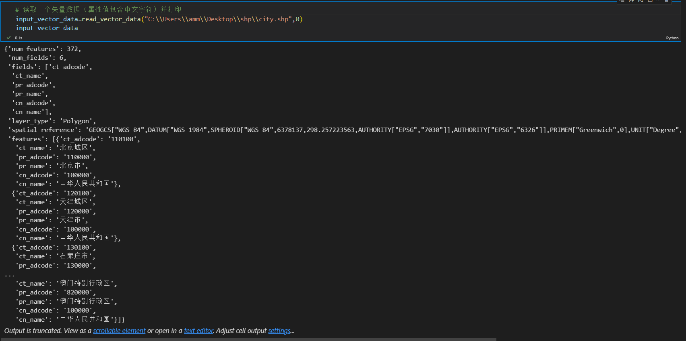
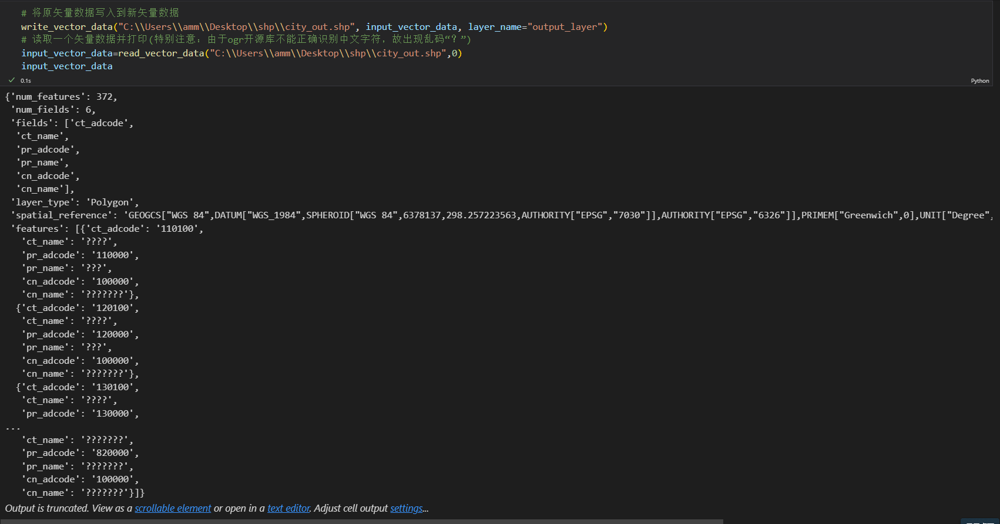
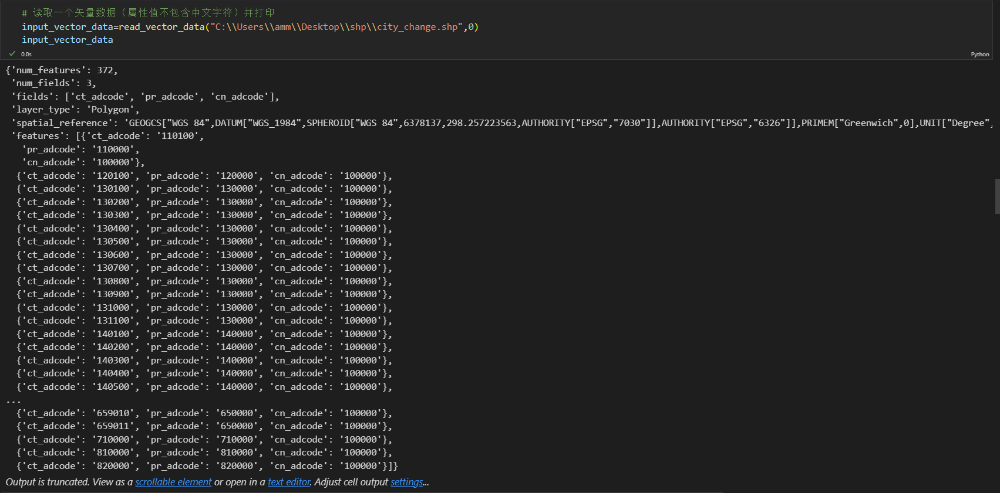
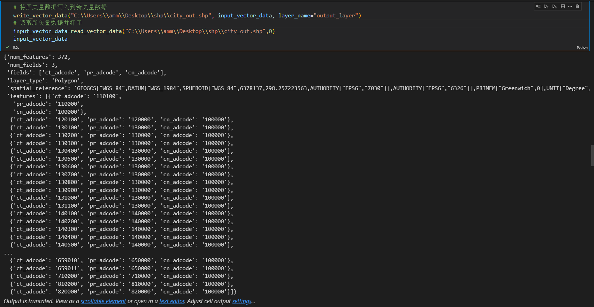
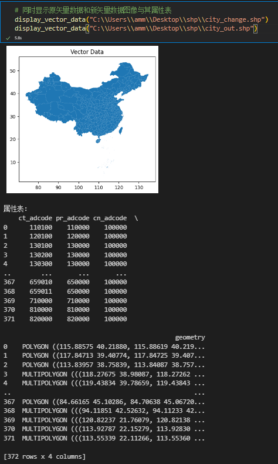
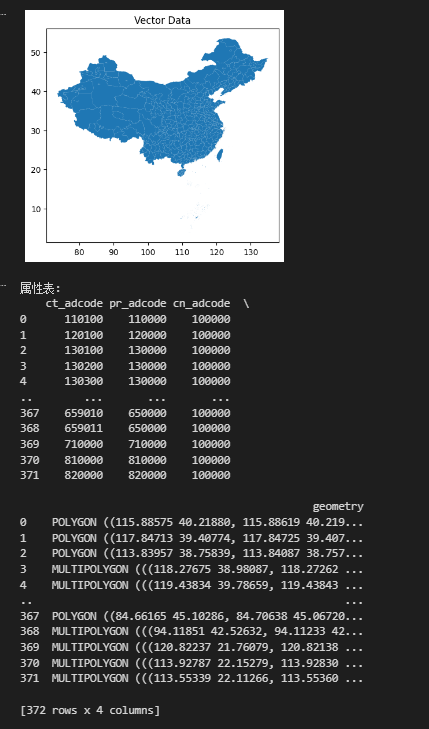
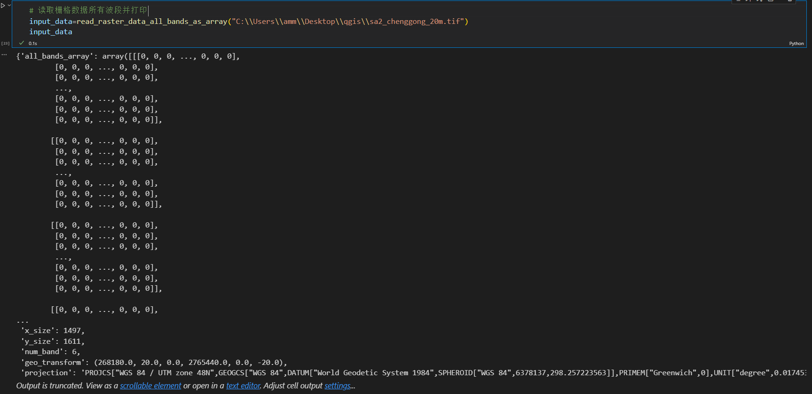
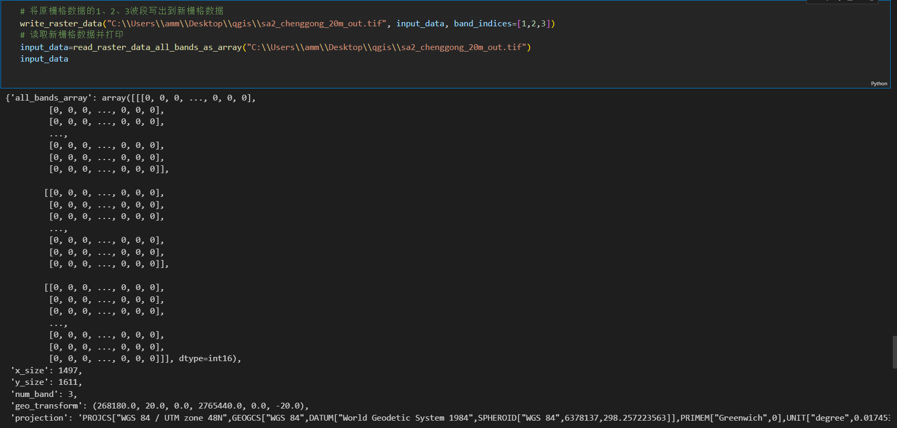
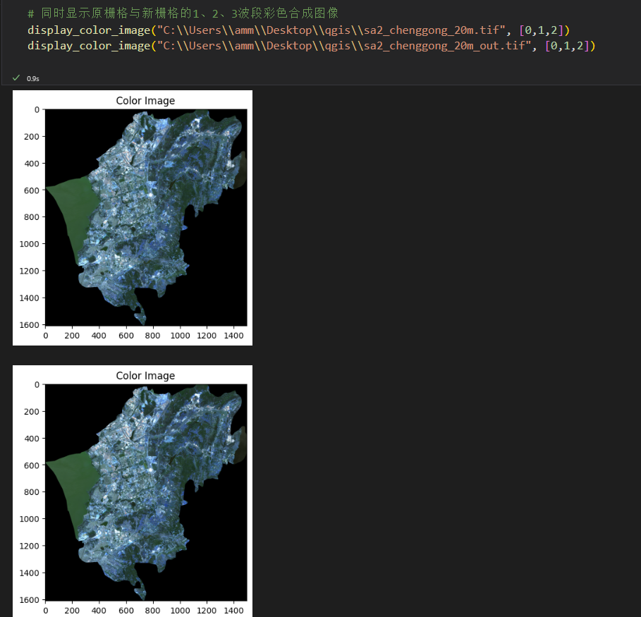

# 第二次作业（魏宇涵 20211170271）
```python
#用到的开源库
from osgeo import ogr,osr,gdal
import numpy as np
import matplotlib.pyplot as plt
import geopandas as gpd
```
## 一、矢量数据
### 1 矢量数据读取函数
```python
# 矢量数据读取函数
def read_vector_data(shapefile_path, layer_index=0):

    # 打开shapefile
    ds = ogr.Open(shapefile_path, 0)  # 0表示只读，1表示可写

    if ds is None:
        raise Exception("无法打开shapefile。")

    # 获取指定索引的图层
    layer = ds.GetLayerByIndex(layer_index)

    if layer is None:
        raise Exception(f"在shapefile中找不到图层索引 {layer_index}。")

    # 获取要素和字段的数量
    num_features = layer.GetFeatureCount()
    num_fields = layer.GetFeature(0).GetFieldCount()

    # 获取字段名
    fields = [layer.GetFeature(0).GetFieldDefnRef(i).name for i in range(num_fields)]

    # 获取图层类型
    layer_type = ogr.GeometryTypeToName(layer.GetGeomType())

    # 获取空间参考
    spatial_ref = layer.GetSpatialRef()

    # 初始化一个字典以存储矢量数据
    vector_data = {
        "num_features": num_features,
        "num_fields": num_fields,
        "fields": fields,
        "layer_type": layer_type,
        "spatial_reference": spatial_ref.ExportToWkt() if spatial_ref else None,
        "features": []
    }

    # 循环处理每个要素
    for i in range(num_features):
        feature = layer.GetFeature(i)
        feature_attributes = {}

        # 获取每个字段的属性
        for j in range(num_fields):
            field_name = fields[j]
            field_value = feature.GetField(field_name)
            feature_attributes[field_name] = field_value

        vector_data["features"].append(feature_attributes)

    # 关闭shapefile
    ds = None
    return vector_data
``` 
“read_vector_data”函数作用：从shapefile读取矢量数据（可指定图层索引）  
参数:
- shapefile_path (str): shapefile的路径。
- layer_index (int): 要读取的图层索引，默认为0。


返回：
- dict: 包含有关要素及其属性的信息的字典，包括要素数量（num_features）、字段数量（num_fields）、字段名（fields）、图层类型（layer_type）、空间参考（spatial_reference）、要素属性信息列表（features）。
### 2 矢量数据写出函数
```python
# 矢量数据写出函数
def write_vector_data(output_shapefile, input_vector_data, layer_name="output_layer"):

    # 创建输出shapefile
    driver = ogr.GetDriverByName("ESRI Shapefile")
    ds_out = driver.CreateDataSource(output_shapefile)

    if ds_out is None:
        raise Exception("无法创建输出shapefile。")

    # 获取空间参考
    spatial_ref = osr.SpatialReference()
    spatial_ref.ImportFromWkt(input_vector_data["spatial_reference"])

    # 映射图层类型到GDAL的OGRwkbGeometryType
    geometry_type_mapping = {
        "Point": ogr.wkbPoint,
        "LineString": ogr.wkbLineString,
        "Polygon": ogr.wkbPolygon,
        'MultiPolygon': ogr.wkbMultiPolygon
    }

    # 获取输出图层类型
    input_layer_type = input_vector_data["layer_type"]

    # 创建图层
    layer_out = ds_out.CreateLayer(layer_name, geom_type=geometry_type_mapping.get(input_layer_type, ogr.wkbUnknown), srs=spatial_ref)

    # 添加字段
    for field_name in input_vector_data["fields"]:
        field_def = ogr.FieldDefn(field_name, ogr.OFTString)
        layer_out.CreateField(field_def)

    # 写入要素
    for feature_attributes in input_vector_data["features"]:
        feature = ogr.Feature(layer_out.GetLayerDefn())

        for field_name, field_value in feature_attributes.items():
            feature.SetField(field_name, str(field_value))

        layer_out.CreateFeature(feature)

    # 关闭数据源
    ds_out = None
``` 
“write_vector_data”函数作用：将原始矢量数据写出为指定路径的新矢量数据    
参数:
- output_shapefile (str): 输出shapefile的路径。
- input_vector_data (dict): 包含要素及其属性的信息的字典，例如通过 read_vector_data 函数获取的数据。
- layer_name (str): 要创建的图层名称，默认为 "output_layer"。


返回:   

- 无，将数据写出到指定路径的shapefile。
### 3 辅助函数（显示矢量数据图像及属性表）
```python
# 显示矢量数据图像及属性表。
def display_vector_data(vector_path):
    
    # 读取矢量数据
    gdf = gpd.read_file(vector_path)

    # 显示矢量数据图像
    gdf.plot()
    plt.title("Vector Data")
    plt.show()

    # 显示属性表
    print("属性表:")
    print(gdf)
```
辅助函数“display_vector_data”作用:显示指定路径的矢量数据图像及其属性表  
参数:
- vector_path (str): 矢量数据文件路径。  

返回:
- 无，显示图像及属性表。
### 4 矢量数据读写函数用法实例演示（PNG）






## 二、栅格数据
### 1 栅格数据读取函数
```python
# 栅格数据读取函数
def read_raster_data_all_bands_as_array(path_rsimg):
    
    # 打开栅格数据
    dset = gdal.Open(path_rsimg)

    if dset is None:
        raise Exception("无法打开栅格数据。")

    # 获取栅格数组尺寸和波段数
    x_size, y_size, num_band = dset.RasterXSize, dset.RasterYSize, dset.RasterCount

    # 读取所有波段的数组，存储为一个三维 NumPy 数组
    all_bands_array = np.array([dset.GetRasterBand(i).ReadAsArray() for i in range(1, num_band + 1)])

    # 获取地理转换参数
    geo_trans = dset.GetGeoTransform()

    # 获取投影信息
    proj = dset.GetProjection()

    # 封装为字典
    raster_data = {
        "all_bands_array": all_bands_array,
        "x_size": x_size,
        "y_size": y_size,
        "num_band": num_band,
        "geo_transform": geo_trans,
        "projection": proj
    }

    return raster_data
```
“read_raster_data_all_bands_as_array”函数作用：读取栅格数据的所有波段数组  
参数:
- path_rsimg (str): 栅格数据文件路径。

返回:
- dict: 包含有关栅格数据的信息的字典，包括所有波段信息的三维数组（all_bands_array）、影像尺寸（x_size/x_size）、波段数（num_band）、地理转换参数（geo_transform）、投影信息（projection）。
### 2 栅格数据写出函数
```python
# 栅格数据写出函数
def write_raster_data(output_path, input_data, band_indices=[1]):

    # 获取要写出的波段数组
    bands_to_write = [input_data["all_bands_array"][i - 1] for i in band_indices]

    # 创建输出数据集
    driver = gdal.GetDriverByName("GTiff")
    ds_out = driver.Create(output_path, input_data["x_size"], input_data["y_size"], len(band_indices), gdal.GDT_Int16)

    if ds_out is None:
        raise Exception("无法创建输出栅格数据集。")

    # 设置地理转换参数和投影信息
    ds_out.SetGeoTransform(input_data["geo_transform"])
    ds_out.SetProjection(input_data["projection"])

    # 将波段数组写入数据集
    for i, band_array in enumerate(bands_to_write, start=1):
        ds_out.GetRasterBand(i).WriteArray(band_array)

    # 关闭数据集
    ds_out = None
```
“write_raster_data”函数作用：将栅格数据写出到指定路径（可指定波段集）  
参数:
- output_path (str): 输出栅格数据路径。
- input_data (dict): 包含有关栅格数据的信息的字典，例如通过 read_raster_data_all_bands_as_array 函数获取的数据。
- band_indices (list): 要写出的波段索引列表，默认为[1]。

返回:
- 无，将数据写出到指定路径的栅格数据。
### 3 辅助函数（显示栅格数据指定波段图像）
```python
# 显示单波段栅格数据图像（可指定波段）
def display_single_band_image(image_path, band_index):

    # 打开影像
    dset_img = gdal.Open(image_path)

    if dset_img is None:
        raise Exception("无法打开遥感影像。")

    # 读取影像为数组
    img_array = dset_img.ReadAsArray()

    # 将数组转置为（高度，宽度，波段数）
    img_array = img_array.transpose(1, 2, 0)

    # 显示指定的单波段
    plt.imshow(img_array[:, :, band_index]) 
    plt.title("Single Band Image")
    plt.show()
```
辅助函数“display_single_band_image”作用：显示指定单一波段图像

参数:
- image_path (str): 栅格数据文件路径。
- band_index (int): 要显示的波段索引。

返回:
- 无，显示单波段图像。
```python
# 指定三波段进行彩色显示
def display_color_image(image_path, band_indices):
    # 打开影像
    dset_img = gdal.Open(image_path)

    if dset_img is None:
        raise Exception("无法打开影像。")

    # 读取影像数据
    img_array = dset_img.ReadAsArray()

    # 将数组转置为（高度，宽度，波段数）
    img_array = img_array.transpose(1, 2, 0)

    # 提取指定的三个波段
    band_color = img_array[:, :, band_indices].copy()

    # 拉伸直方图
    band_color_dn = band_color.flatten()
    min_dn, max_dn = np.percentile(band_color_dn, 1), np.percentile(band_color_dn, 99)
    band_color_stretched = np.clip(band_color, min_dn, max_dn)
    band_color_stretched = (band_color_stretched - min_dn) / (max_dn - min_dn)

    # 显示彩色影像
    plt.imshow(band_color_stretched)
    plt.title("Color Image")
    plt.show()
```
辅助函数“display_color_image”作用：指定三波段进行彩色图像显示  

参数:
- image_path (str): 栅格数据文件路径。
- band_indices (list): 要显示的3个波段索引列表。

返回:
- 无，显示彩色图像。
### 4 栅格数据读写函数用法实例演示（PNG）




